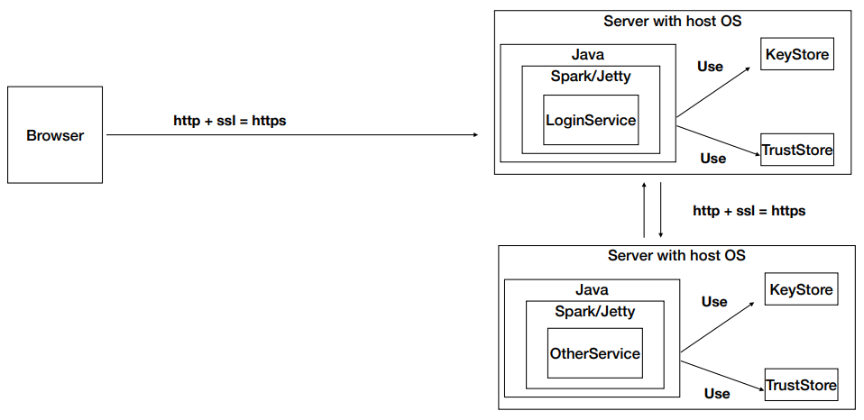
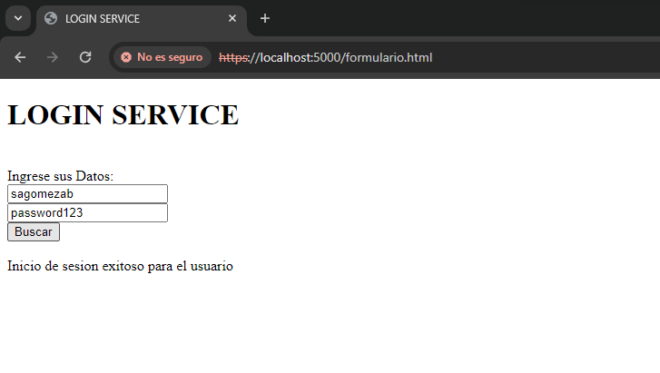
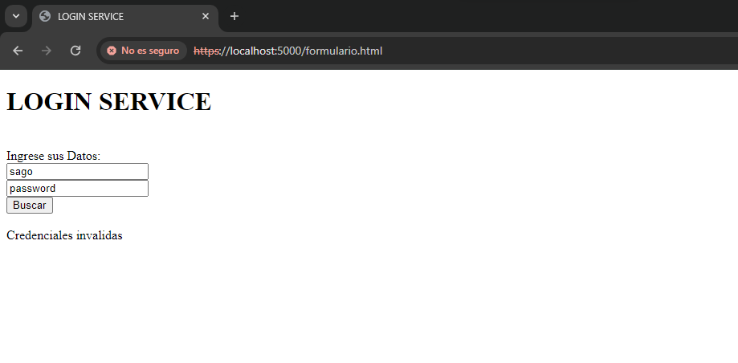
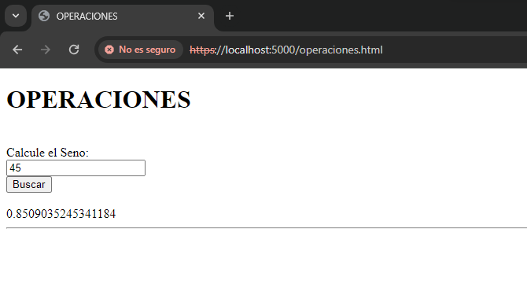
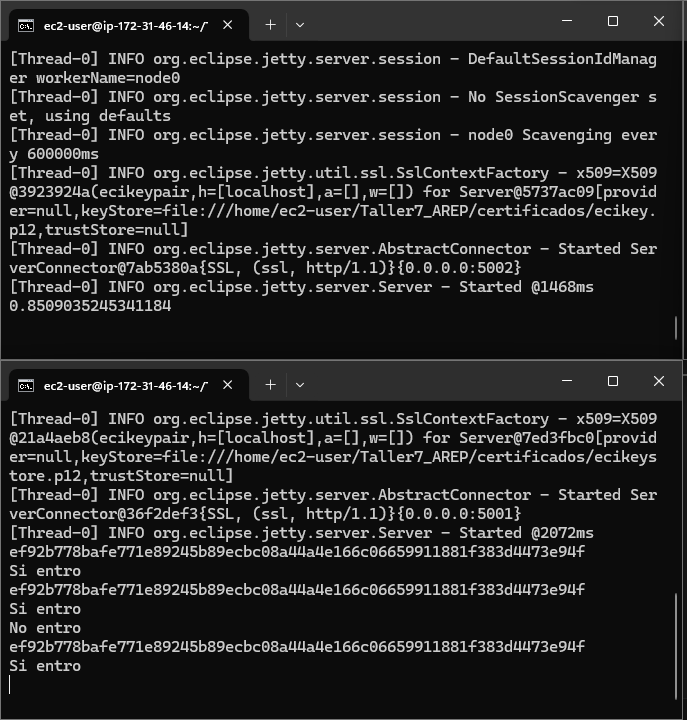
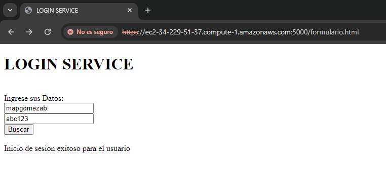
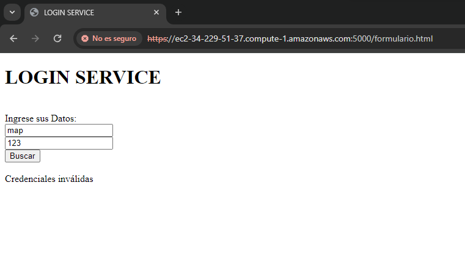
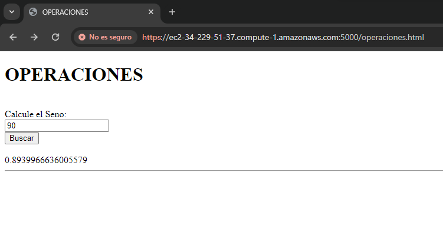

# TALLER 7: APLICACIÓN DISTRIBUIDA SEGURA EN TODOS SUS FRENTES
#### Hecho por: Daniel Santiago Gómez Zabala

Se va a crear la siguiente arquitectura, usando una instancia EC2 de AWS, instalando dentro de la instancia java para la ejecución de las clases involucradas.



## GETTING STARTED

1. Debe tener instalado Maven en su computador para poder ejecutar los comandos que se le indicarán más adelante.
2. Debe contar con GITHUB para poder hacer uso del repositorio donde se alberga el laboratorio.
3. Debe tener un ambiente de java para poder visualizar y ejecutar el codigo.

## INSTALLING

Debe clonar el respositorio para poder hacer uso de la app con el comando que se encuentra a continuación

```
https://github.com/sagomezab/Taller7_AREP.git
```

En este caso la clonación del repo ser para visualizar lo realizado y la ejecución de cada Tarea

## Test

Los usuarios registrados en el sistema con sus respectivas contraseñas son los siguientes:

- ("sagomezab", "password123")
- ("mapgomezab", "abc123")
- ("javierfgomezb", "contraseñaSegura")

### Prueba Local

Para ejecutar las clases correspondientes debe usar los siguientes comandos desde el CMD (Simbolo del Sistema)

1. Ejecute *mvn package* se utiliza para empaquetar el proyecto y generar el archivo de distribución definido en el proyecto, como un archivo JAR (Java ARchive), un archivo WAR (Web ARchive), o un archivo de distribución de otro tipo según la configuración del proyecto.

2. Ejecute cada clase individualemente con los isguientes comandos

    ```
    java -cp "target/classes:target/dependency/*" co.edu.escuelaing.securespark.OperationServer

    java -cp "target/classes:target/dependency/*" co.edu.escuelaing.securespark.SecureServer

    java -cp "target/classes:target/dependency/*" co.edu.escuelaing.securespark.HelloWorld
    ```
3. Luego ingrese a la siguiente dirección y combruebe el funcionamiento local del la aplicación

    ```
    https://localhost:5000/formulario.html
    ```

4. Debe visualizar lo siguiente:

    En caso de acceder con exito

    

    En caso de no poder acceder ya sea por tener la constraseña o usuario incorrecto

    

    Después de poder ingresar debera ver lo siguiente

    


### Prueba en AWS

Para el despliegue en AWS se utilizo una instancia de EC2 en la cual se realizaron ejecuciones de maquina virtuales de java para poder ejecutar y permitir la interacción de los servicios

Debe tener previamente instalado maven, java y git en la instancia para poder realizar las siguiente pruebas

1. Abra tres veces la instancia de AWS y clone el repositorio con el siguiente enlace

    ```
    https://github.com/sagomezab/Taller7_AREP.git
    ```

2. Ejecute las clases involucradas para el funcionamiento del sistema con lo siguientes comandos (*Reecuerde realizar mvn package antes de ejecutar las clases*):

    ```
    java -cp "target/classes:target/dependency/*" co.edu.escuelaing.securespark.OperationServer

    java -cp "target/classes:target/dependency/*" co.edu.escuelaing.securespark.SecureServer

    java -cp "target/classes:target/dependency/*" co.edu.escuelaing.securespark.HelloWorld
    ```

    La ejecución dentro de la instancia debe verse de la siguiente forma:

    

3. Ingrese al siguiente enlace y compruebe el funcionamiento

    ```
    https://ec2-34-229-51-37.compute-1.amazonaws.com:5000/formulario.html
    ```

4. Debe visualizar lo siguiente:

    En caso de acceder con exito

    

    En caso de no poder acceder ya sea por tener la constraseña o usuario incorrecto

    

    Después de poder ingresar debera ver lo siguiente

    


## Current Architecture

La arquitectura actual se encuentra con un cliente que pide un servicio por con certificaciones ssl y además hay dos servicios que se comunican entre sí también con ssl, se ve de la siguiente forma:


## Architectural Scaling

- Escalabilidad horizontal: Agrega más instancias del servicio principal (login) y tambien escalar el servicio de operaciones para manejar un mayor volumen de solicitudes. Creando más intancias de EC2 de AWS para relizar más conexiones, en caso de un incremento considerable del servicio seria necesario escalar tambien el secureservice.

- Escalabilidad vertical: Si las instancias existentes del servicio principal están alcanzando sus límites de capacidad, considera mejorar la capacidad de las instancias existentes aumentando los recursos del servidor (por ejemplo, CPU, RAM). Esto se conoce como escalabilidad vertical.

- Caché: Implementariá una capa de caché para almacenar en caché respuestas a solicitudes frecuentes. Esto puede reducir la carga en el servicio principal y mejorar los tiempos de respuesta para los clientes.

- Optimización de consultas: Realizar consultas de una forma más eficiente entre los servicios y las diferentes API.

### Video

* [Video Probatorio](https://youtu.be/C6-9Cdy9fSs)

## Built With

* [Maven](https://maven.apache.org/) - Administrador de dependencias

## Version

1.0
## Author

Daniel Santiago Gómez Zabala [SAGOMEZAB](https://github.com/sagomezab)

## Acknowledgments

### Código
* **HelloWorld.java** Utiliza un servicio web utilizando Spark Java que escucha en el puerto definido por la función getPort(). Cuando se recibe una solicitud en la ruta /login, el cual verifica y autoriza el ingreso de los usuarios ya predefinidos en un hashmap y ademas encripta con sha-256 las contraseñas albergadas. Además, Utiliza secure("certificados/ecikeystore.p12", "123456", null, null) para configurar el servidor para que utilice SSL (Secure Sockets Layer). Especifica el archivo de certificado (certificados/ecikeystore.p12), la contraseña del certificado (123456) y otros parámetros de configuración.
* **OperationServer.java** Utiliza un endpoint que realiza una operacion de seno por un valor que se le ingresa desde el cliente. Además, Utiliza secure("certificados/ecikey.p12", "123456", null, null) para configurar el servidor para que utilice SSL (Secure Sockets Layer). Especifica el archivo de certificado (certificados/ecikey.p12), la contraseña del certificado (123456) y otros parámetros de configuración.
### AWS

Una instancia EC2 de Amazon Web Services (AWS) es un servidor virtual que puedes lanzar en la nube de AWS. Estas instancias te permiten ejecutar aplicaciones y trabajar con sistemas operativos de tu elección, en este caso fue Linux.